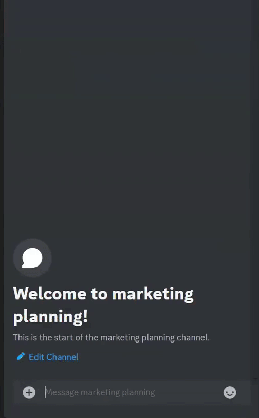

# Discord Messenger Bot
Messenger Bot is a Discord bot that allows users to schedule messages, announcements, and reminders in Discord server channels and threads.

## Features
- Schedule messages to be sent at a specific time.
- Send reminders to specific channels or threads.
- Supports multiple servers.

## Installation
1. Clone this repository.
2. Install the dependencies with `npm install`.
3. Create a `config.json` file in the root directory and fill it with your bot's token, client ID, and guild ID.
4. Run `node src/deploy-commands.js` to deploy the bot's commands.
5. Run `node src/index.js` to start the bot.

## Usage
After inviting the bot to your server, you can use the following slash commands:

- `/schedule`: Schedule a new message.
- `/messages`: List all scheduled messages.

## Demonstration
Here's a demonstration of the bot being used:

## Bot Invite Link
You can invite the bot to your server using [this link](https://discord.com/api/oauth2/authorize?client_id=1178623670495748116&permissions=26914413075520&scope=bot).

## Inspiration for the Project
### Background
This project was initiated during my tenure as a Marketing Director for a university society. At the time, I recognised the need for a tool that could schedule messages, reminders, and announcements within our team's Discord server. The idea was to automate these routine tasks, freeing up more time for us to focus on our core responsibilities.

Despite having limited experience with bot development, I decided to take on the challenge. I started learning about Discord bot development and the Discord.js library, which forms the backbone of this project.

### Motivation
The primary motivation behind this project was to streamline communication within our team. We often found ourselves forgetting to send important reminders and complete certain tasks due to our busy schedules. A tool that could schedule these messages in advance was the perfect solution.

Existing solutions, such as external third-party reminder tools, lacked the integration we needed with Discord, which we used for most of our communication within the team. Moreover, existing Discord reminder bots were either out of date and lacked the newly-introduced Discord command interface, only allowed users to set reminders within a few days in the future, or were heavyweight bots designed for general server administrations, making it very difficult to set up for smaller servers. Therefore, the decision was made to develop a custom Discord bot tailored to our needs.

This bot, while initially designed to meet the specific needs of the marketing team, has been developed with a broader user base in mind. It can be easily deployed in any Discord server and used by any team that needs to schedule messages, reminders, or announcements.

### Future Developments
There are several ways this Discord bot could be further developed in the future:

- Integration with other platforms, such as Google Calendar or Slack.
- Advanced scheduling features, such as recurring reminders or event countdowns.
- A web interface for easier scheduling and management of messages.
- Additional bot commands for more complex interactions.
- An admin interface so that server owners can view all scheduled messages made by anyone in the server.

## Rights
All rights reserved. No part of this software may be reproduced, distributed, or transmitted in any form or by any means, without the prior written permission of the author.
